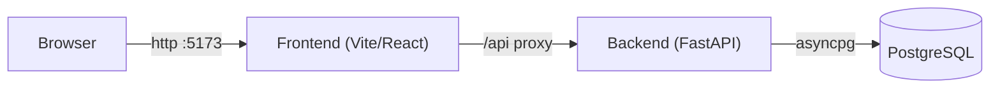

# LinkPulse

A personal bookmark manager: save links, auto-extract metadata (title,
description, image, favicon), tag and search your collection, and view a
dashboard of your browsing patterns.

## Tech stack

| Layer    | Technology                                                            |
| -------- | --------------------------------------------------------------------- |
| Frontend | React 19, TypeScript, Vite, TailwindCSS 4, TanStack Query, React Router 7, Recharts |
| Backend  | Python 3.12, FastAPI, Pydantic v2, SQLAlchemy 2 (async), PostgreSQL, Alembic |
| Testing  | Playwright (E2E), Vitest (frontend), pytest (backend)                 |
| Infra    | Docker Compose, GitHub Actions CI, Greptile PR review                 |

## Architecture



- The **frontend** is a single-page app. In dev, Vite proxies `/api` to the
  backend, so the browser makes same-origin requests (no CORS).
- The **backend** is a FastAPI app with an async SQLAlchemy 2 layer. It scrapes
  page metadata with httpx + BeautifulSoup (behind an injectable interface).
- **PostgreSQL** stores three tables: `bookmarks`, `tags`, and a
  `bookmark_tags` join. Schema changes are managed with Alembic migrations.

```
LinkPulse/
├── backend/          FastAPI app (app/), Alembic migrations, tests
├── frontend/         React app (src/), Vite config, tests
├── e2e/              Playwright end-to-end tests
├── docker-compose.yml       dev stack (Postgres + backend + frontend)
├── docker-compose.test.yml  E2E stack (stub fetcher + test-reset endpoint)
└── GamePlan/         sprint planning docs
```

## Setup

### Option A — Docker Compose (recommended)

Prerequisites: Docker Desktop.

```bash
cp .env.example .env          # local dev values (safe defaults)
docker compose up -d --build  # starts Postgres + backend + frontend
```

- App: <http://localhost:5173>
- API docs (Swagger UI): <http://localhost:8000/docs>

The backend applies migrations on startup. Stop with `docker compose down`
(add `-v` to also wipe the database volume).

### Option B — Manual

Prerequisites: Python 3.12+, Node 22, and a PostgreSQL 16 instance.

```bash
cp .env.example .env          # point DATABASE_URL at your Postgres

# Backend
cd backend
python3 -m venv .venv && ./.venv/bin/pip install -e ".[dev]"
./.venv/bin/alembic upgrade head          # create the schema
./.venv/bin/uvicorn app.main:app --reload # serves :8000

# Frontend (in another terminal)
cd frontend
npm ci
npm run dev                               # serves :5173
```

## Tests

```bash
# Backend (needs a Postgres db named *_test; DATABASE_URL points at it)
cd backend && ./.venv/bin/pytest --cov=app

# Frontend
cd frontend && npm run test

# End-to-end (brings up the full stack, then runs Playwright)
docker compose -f docker-compose.test.yml up -d --build
cd e2e && npm ci && npx playwright install --with-deps chromium && npx playwright test
```

## API

Base URL: `/api` (proxied to the backend). Interactive docs at `/docs`.

| Method | Path                     | Description                                   |
| ------ | ------------------------ | --------------------------------------------- |
| GET    | `/api/health`            | Liveness probe → `{"status":"ok"}`            |
| POST   | `/api/bookmarks`         | Create a bookmark (scrapes metadata)          |
| POST   | `/api/bookmarks/preview` | Scrape a URL's metadata **without** saving    |
| GET    | `/api/bookmarks`         | List (pagination + filters + sort)            |
| GET    | `/api/bookmarks/{id}`    | Get one bookmark                              |
| PATCH  | `/api/bookmarks/{id}`    | Update notes / starred / tags                 |
| DELETE | `/api/bookmarks/{id}`    | Soft-delete a bookmark                        |
| GET    | `/api/tags`              | List tags with bookmark counts                |
| POST   | `/api/tags`              | Create a tag                                  |
| PATCH  | `/api/tags/{id}`         | Rename / recolor a tag                        |
| DELETE | `/api/tags/{id}`         | Delete a tag                                  |
| GET    | `/api/stats`             | Dashboard aggregates                          |

### Examples

Create a bookmark:

```bash
curl -X POST localhost:8000/api/bookmarks \
  -H 'Content-Type: application/json' \
  -d '{"url": "https://react.dev", "tags": ["frontend"]}'
```

```json
{
  "id": "…", "url": "https://react.dev/", "title": "React",
  "domain": "react.dev", "is_starred": false, "is_deleted": false,
  "tags": [{ "id": "…", "name": "frontend", "color": "#6366f1" }]
}
```

List with filters (all optional): `?limit=20&offset=0&search=react&tag=frontend&starred=true&sort=title`

```json
{ "items": [ /* Bookmark[] */ ], "total": 1, "limit": 20, "offset": 0 }
```

Update a bookmark (partial):

```bash
curl -X PATCH localhost:8000/api/bookmarks/{id} \
  -H 'Content-Type: application/json' \
  -d '{"is_starred": true, "notes": "read later", "tags": ["frontend", "docs"]}'
```

Duplicate URLs return `409`; unreachable URLs are saved with the URL only;
invalid input returns `422`.

## Development workflow

- Branch per change (`feat/…`), open a PR against `main` (protected).
- CI (GitHub Actions) runs lint, type-check, unit tests, and E2E on every PR.
- Greptile posts an AI review; resolve its threads before merging.
- Squash-merge to keep `main` history one commit per change.
